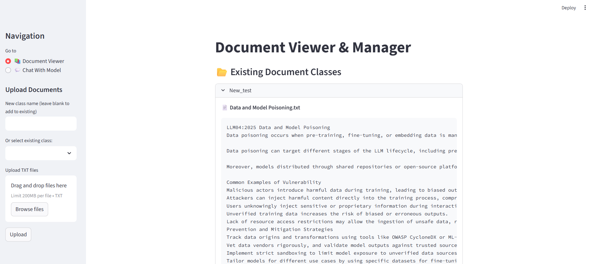
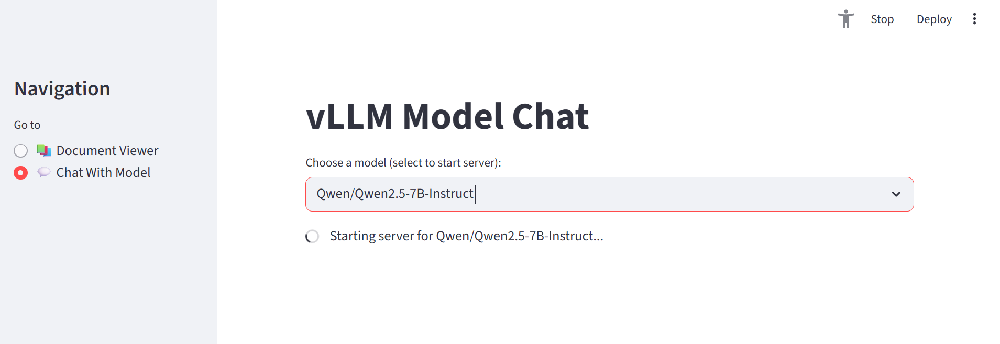
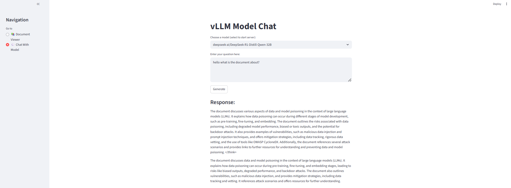

# VLLM Model Setup with Streamlit

This project demonstrates the setup of a VLLM server to host a language model and expose it via a Streamlit-based application. The application allows users to upload documents and interact with the language model by querying it directly.

### 1. Start the weaviate server
```bash
cd weaviate
docker-compose up
```

### 2. Run the application
```bash
cd applications
streamlit run vllm_model_multi.py
```
Note: The model starts loading only after user selects one. The status of the server would be recorded and saved in logs/vllm_multi_8000.log

## Application Screenshots

### Upload Documents


### Starting the VLLM Server


### Query the Model

